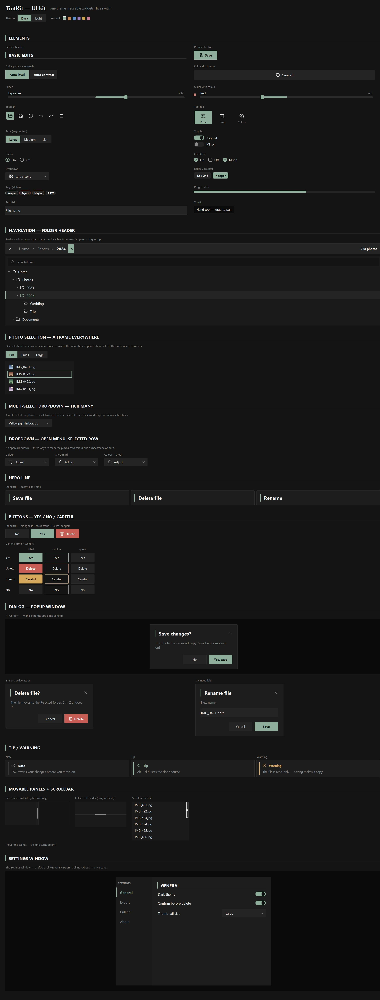
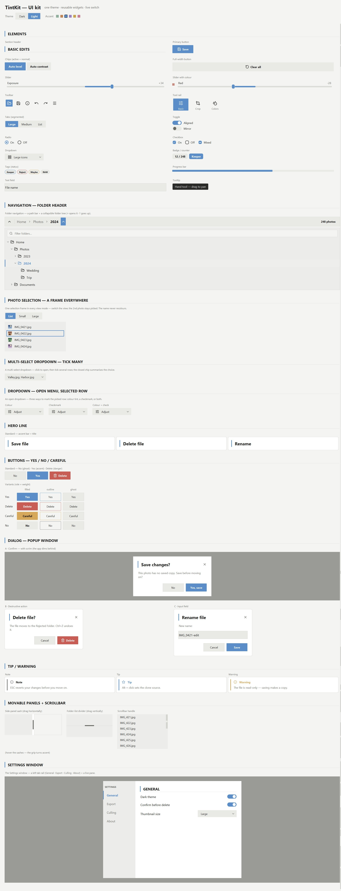

# TintKit

A small, themeable **tkinter** UI kit — a dark/light photo-tool look as reusable
controls. One theme drives every colour, widgets reuse each other, and the look
switches live with no restart.

  




## Run the gallery

```bash
python gallery.py
```

Every component in one scrollable window, with a live **Dark / Light + accent**
switcher at the top — the whole window repaints instantly. (The handlers are
demos; the controls themselves are genuinely interactive.)

## Install

```bash
pip install git+https://github.com/kandelucky/tintkit
```

Pure-stdlib tkinter — **zero required dependencies**. For the bundled
[Lucide](https://lucide.dev/) icons (recoloured per theme) also `pip install
pillow`; without it widgets still work and shapes stay anti-aliased (drawn in
pure Tk) — only the glyphs are skipped. Point at your own icons with
`set_icon_dir("…/my_icons")`.

## Use it

```python
import tkinter as tk
from tintkit import Theme, setup_dpi, Button, Toggle

root = tk.Tk()
setup_dpi(root)                       # crisp icons on high-DPI screens
theme = Theme(scheme="dark", accent="#8fae9b")

Button(root, theme, "Save", icon="save", command=lambda: print("saved")).pack()
Toggle(root, theme, value=True, command=lambda on: print(on)).pack()
root.mainloop()
```

Every widget takes the same first two args — the parent and the shared `theme` —
and returns an object you `.pack()` / `.grid()` like any tk widget. One theme is
the single source of truth; change it and the whole tree repaints:

```python
theme.set(scheme="light")             # dark <-> light
theme.set(accent="#c08457")           # any accent; shades derived for you
theme.toggle_scheme()
```

Read any token anywhere with `theme["accent"]`, `theme["panel"]`,
`theme["r_control"]` …

## What's inside

| module | what it holds |
|---|---|
| `tintkit/theme.py` | dark/light schemes, accent + danger/warn derivation, repaint observer |
| `tintkit/icons.py` | the Lucide icon loader (recoloured per theme) |
| `tintkit/primitives.py` | `rounded_rect`, the `CanvasControl` base, themed `Surface` / `Label` |
| `tintkit/controls.py` | Button, Slider, Toggle, Radio, Checkbox, SegmentedTabs, Dropdown, Badge, Tag, ProgressBar, Tooltip, TextField |
| `tintkit/containers.py` | Card, dialog, callout, section header, drag sashes, scrollbar |
| `tintkit/composites.py` | toolbar, tool rail, folder nav + tree, selection views, settings window |
| `gallery.py` | the style guide window + live switcher |

**Design rules:** no widget hard-codes a colour (each reads `theme[...]` and
repaints on change); one radius scale — `r_control` / `r_pill` / `r_card`, no
magic numbers; widgets reuse widgets; all glyphs are
[Lucide](https://lucide.dev/) PNGs (ISC) recoloured at load.

## License

MIT — see [LICENSE](LICENSE).
